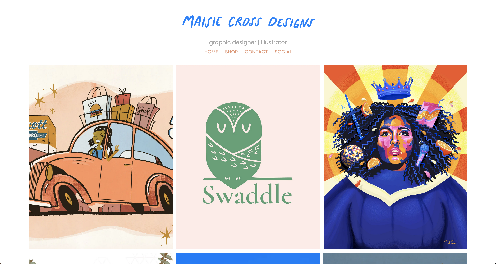

<h1 align="center"><project-name>Maisie Cross Designs Website</h1>

<project-description>Personal graphic designer portfolio website for Maisie Cross.

## Concept
My wife is a professional graphic designer who was in need of a portfolio site to increase her freelance clientele and display some of her work. She wanted something sleek and clean that would be easy to navigate. Everything was built in Gatsby, with each project being queried from a markdown file via GraphQL. There's a contact form, a social link that takes the user to her personal Instagram, and a shop link which will (soon) link to her personal Etsy site once it's set up. The site is highly responsive and appeals to viewers across all devices. 

## Links

- [https://github.com/Saige243/mcd_website](https://github.com/Saige243/mcd_website "<project-name> Repo")

- [www.maisiecrossdesigns.com](https://maisiecrossdesigns.com)

## Screenshots

Home Page

Responsive Home Page

## Available Commands

Simply run:

### `gatsby develop`

## Built With

- JavaScript
- Gatsby
- GraphQL
- HTML
- CSS
- NPM

## Author

**Saige Cross**

- [Saige243 GitHub](https://github.com/Saige243 "Saige Cross")
- [saigecrossdev@gmail.com](mailto:saigecrossdev@gmail.com?subject=Hi "Hi, Saige!")

