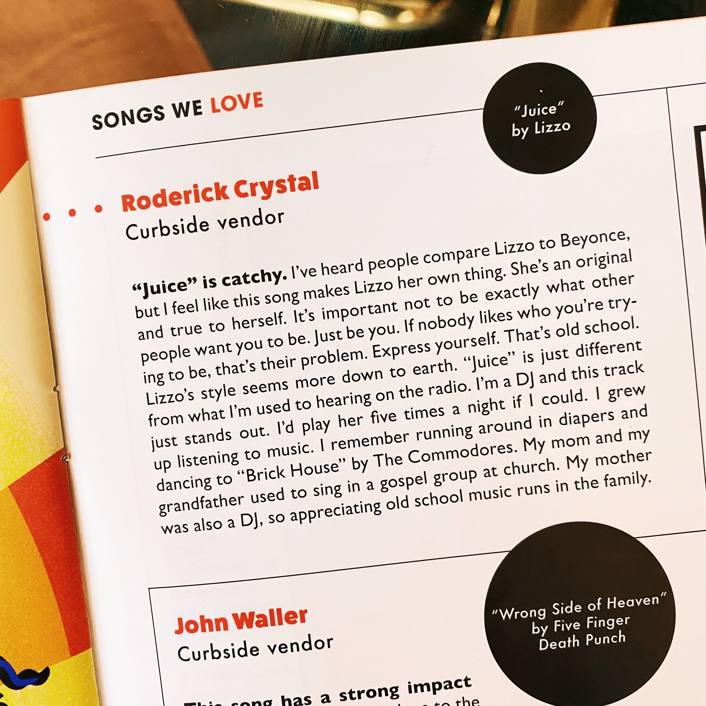
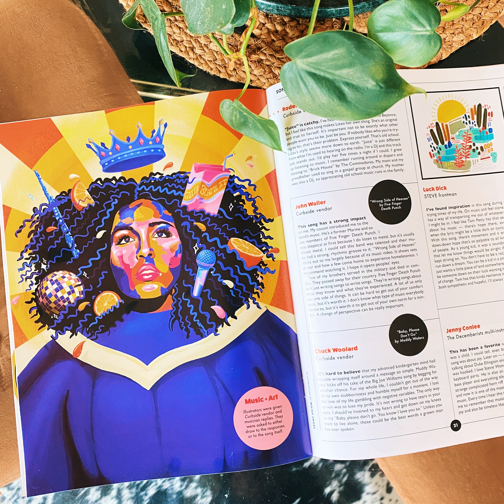

<!-- **Lorem ipsum**
lorem lorem lorem lorema;slkdjflljd -->

### Illustration for Curbside Chronicle
##### ILLUSTRATION • PRINT COLLATERAL • VISUAL STORYTELLING

The Curbside Chronicle is Oklahoma’s street paper created to provide both a voice and employment opportunities for people who are experiencing and at risk of homelessness. 

This particular issue was on the communal power of music, and featured a number of writer's reflections on the music they love. I was chosen to illustrate a piece for a column about Lizzo's song, Juice.  

