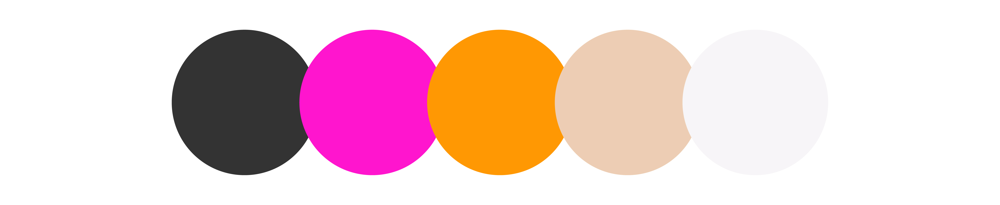

<!-- **Lorem ipsum**
lorem lorem lorem lorema;slkdjflljd -->

### MidWind Solutions Branding
##### BRAND & LOGO DESIGN 
MidWind Solutions was started by six friends with a love for renewable energy, specifcally, wind turbines. MidWind Solutions will be servicing existing turbines by providing one service line with hopes of branching into other areas of the future. 

The three lines in the logo represent three abstracted turbine blades that play into the wind's motion. The color scheme was chosen by the team, who are all inspired by seventies tones, which in turn inspired the typography.

